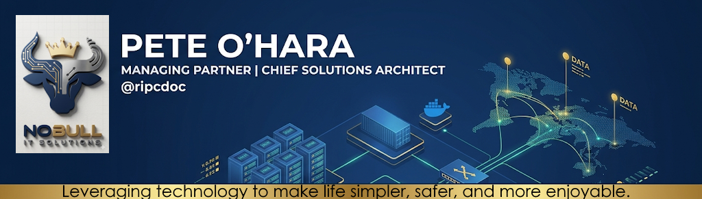

## 🚀 About Me

* 💼 **Role:** Managing Partner & Chief Solutions Architect at **NoBull IT Solutions**
* 💡 **Mission:** Driving real-world efficiency and solving complex problems through pragmatic tech
* 🌱 **Currently Exploring:** The rapidly evolving landscape of AI—the good, the bad, and the practical
* 🐶 **Personal:** Proud dog dad to Prince & Rocky 🐾
* 💬 **Pronouns:** He / Him / His
* ⚡ **Fun Fact:** A group of flamingos is called a *flamboyance*! 🦩

---

## 💼 Specialized Services & Capabilities

* 🌐 **Enterprise Networking & Security:** Network design, VLAN segmentation, firewall management (SonicWALL, Cisco, Ubiquiti), and zero-trust remote access (Tailscale, WireGuard).
* 🖥️ **Server & Cloud Infrastructure:** On-prem, hybrid, and cloud hosting, system administration (Linux, Windows Server), and virtual environments (Proxmox, VMware).
* 🛡️ **Data Protection & Compliance:** Disaster recovery planning, backup implementations (Veeam, Acronis), and HIPAA/CDPS-aligned data security.
* 📞 **VoIP & Communications:** Business phone system architecture, VoIP deployments, and unified communications routing.
* ⚡ **Managed IT & Automation:** Proactive monitoring, infrastructure automation, container management (Docker, Portainer), and customized web deployments.

---

## 🛠️ Tech Stack, Certifications & Focus Areas

---

### 📫 Connect With Me

Feel free to connect with me on [LinkedIn](https://www.linkedin.com/in/peteroharari/) for IT consulting, infrastructure discussions, or tech collaborations.

 <a
    id="cy-effective-orcid-url"
    class="underline"
     href="https://orcid.org/0009-0002-0586-752X"
     target="orcid.widget"
     rel="me noopener noreferrer"
     style="vertical-align: top">
     
      https://orcid.org/0009-0002-0586-752X
    </a>

    
