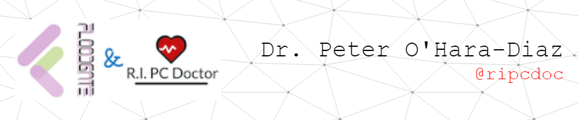

- 👋 Hi, I’m Dr. Peter O'Hara-Diaz (@ripcdoc)
- 👀 I’m interested in ...
- 🌱 I’m currently learning ...
- 💞️ I’m looking to collaborate on ...
- 📫 How to reach me ...
- 😄 Pronouns: "He/him/his"
- ⚡ Fun fact: ...

### Connect with me :smiley:

  

